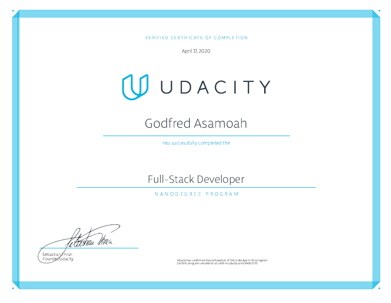

# Full Stack Developer Nanodegree Projects

This repository contains my projects for Udacity's [Full Stack Developer Nanodegree Program](https://www.udacity.com/course/full-stack-web-developer-nanodegree--nd0044).

## Projects

- [1 - Fyurr](/1-fyurr): Design and build an artist/venue booking application

- [2 - Trivia API](/2-trivia-api): Build a trivia API and learn how to control and manage web applications, including best practices for API testing and documentation.

- [3 - Coffee Shop Full Stack](/3-coffee-shop): Build the backend for a coffee shop application. You’ll add user accounts and authentication to your application and use role-based access management strategies to control different types of user behavior in the app.

- [4 - Deploy to Kubernetes using EKS](/4-flask-kubernetes): Create a container for a Flask web app using Docker and deploy the container to a Kubernetes cluster using Amazon EKS.

- [5 - Capstone Project](/5-capstone): The Casting Agency capstone project models a company that is responsible for creating movies and managing/assigning actors to those movies.

## Graduation Certificate🎉🎉

[Certificate Link](https://confirm.udacity.com/KARG3T35)
